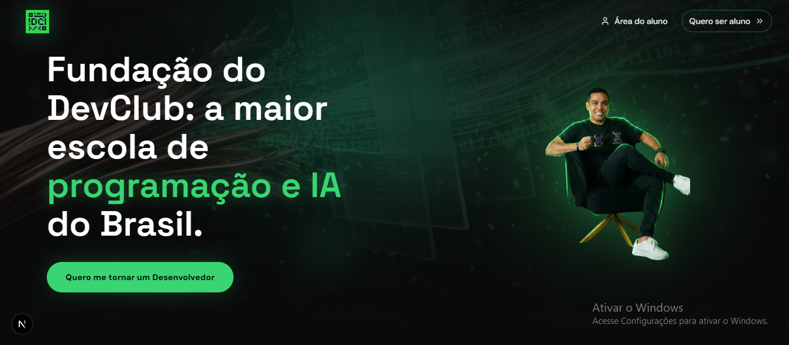

<h1 align="center">DevClub — Landing Page</h1>

<p align="center">
  Landing page institucional da DevClub, a maior escola de programação e IA do Brasil. Conta a jornada do fundador (de eletricista a desenvolvedo contratado) através de uma experiência de scroll cinematográfica, e apresenta a formação, a mentoria 360° e a prova social da escola até a conversão final.
</p>

<p align="center">
  <a href="#-sobre-o-projeto">Sobre o projeto</a>&nbsp;&nbsp;|&nbsp;&nbsp;
  <a href="#-funcionalidades">Funcionalidades</a>&nbsp;&nbsp;|&nbsp;&nbsp;
  <a href="#-tecnologias">Tecnologias</a>&nbsp;&nbsp;|&nbsp;&nbsp;
  <a href="#-ias-utilizadas">IAs utilizadas</a>&nbsp;&nbsp;|&nbsp;&nbsp;
  <a href="#-como-executar">Como executar</a>&nbsp;&nbsp;|&nbsp;&nbsp;
  <a href="#-decisões-técnicas">Decisões técnicas</a>
</p>

<br>

<p align="center">
  
</p>

---

## 🏠 Sobre o projeto

A landing page da **DevClub** foi construída em cima de uma seção Hero
que conduz o visitante por uma história em 5 atos enquanto ele rola a
página - do eletricista sem perspectiva ao embaixador da OpenAI no
Brasil - culminando na montagem da logo da marca em tempo real e no
seu "pouso" na diagonal superior esquerda do header.

O foco do projeto foi tratar motion design como parte do produto, não
como decoração: toda a coreografia de scroll (GSAP + ScrollTrigger) é
100% manual e reversível - nunca avança sozinha, só reage à posição
real do scroll do usuário, para frente ou para trás - e tudo respeita
`prefers-reduced-motion`, pulando a história inteira para o estado
final estático quando o usuário pede menos movimento.

---

## 🧰 Funcionalidades

**Hero cinematográfico**
- Scroll story em 5 fases (eletricista → programador → embaixador da
  OpenAI → desconstrução/montagem da logo → headline final), com pin
  de seção e crossfades por opacidade (sem zoom nas fotos)
- Logo se desconstrói em fragmentos que voam das 4 pontas da tela,
  converge no centro e depois "anda" na diagonal até a marca fixa do
  header, com handoff seguro em qualquer direção de scroll
- Spotlight neon que segue o cursor do mouse pelo Hero
- 100% reversível e sem autoplay: a animação é uma função direta da
  posição de scroll, com fallback seguro para `prefers-reduced-motion`

**Restante da página**
- Marquee duplo (stack de tecnologias e empresas que contrataram
  alunos) com desaceleração suave no hover
- BentoGrid com diploma reconhecido pelo MEC e preview da plataforma
  de prática de código
- Grade curricular em acordeão, ecossistema de mentoria 360° e prova
  social em carrossel
- FAQ em acordeão com física de mola (spring) no lugar de transições
  secas de altura fixa

**Geral**
- Totalmente responsivo (mobile, tablet, desktop e ultra-wide)
- Sem chaves, tokens ou credenciais no código - página 100% estática
- Auditoria de deploy: sem assets órfãos, sem código morto, lint e
  build de produção limpos

---

## 💻 Tecnologias

- **Next.js 16** (App Router, Turbopack)
- **React 19**
- **TypeScript**
- **Tailwind CSS 4**
- **GSAP** + **ScrollTrigger** - coreografia de scroll do Hero
- **Framer Motion** - acordeões (Grade Curricular, FAQ) e reveals de
  entrada
- **ESLint** (`eslint-config-next`, com `react-hooks` em modo estrito)

---

## 🤖 IAs utilizadas

- **Claude Code**: usado como par de desenvolvimento durante todo o
  projeto, principalmente na parte mais delicada da página - a
  coreografia de scroll do Hero em GSAP/ScrollTrigger. Isso incluiu
  desenhar a timeline cinematográfica (fases, pausas, crossfades),
  diagnosticar bugs sutis de sincronismo entre o scroll suavizado
  (`scrub`) e o pino da seção, corrigir uma race condition real entre
  o portal da logo do header e a medição de posição para o "docking",
  e conduzir uma varredura completa de responsividade em todas as
  seções. Também conduziu a auditoria final de pré-deploy (segurança,
  assets órfãos, código morto e triple-check de `tsc`/lint/build) e
  validação visual das telas com Playwright. Todo o código gerado foi
  revisado e testado manualmente antes de aceito.
- **Gemini**: usado como apoio durante todo o processo para discutir
  ideias, tirar dúvidas e validar decisões antes de implementá-las.

---

## 👷 Estrutura do projeto

```
src/
  app/
    layout.tsx       # fontes, metadata e shell HTML
    page.tsx          # composição das seções da landing page
    globals.css       # tokens de cor/tema e estilos globais
  components/
    sections/         # Hero, Marquee, BentoGrid, Formacao, Mentoria,
                       # Depoimentos, Faq, Footer
    ui/                # NeonButton, Reveal (componentes reutilizáveis)
  lib/
    data.ts            # conteúdo estático (stack, empresas, currículo, FAQ)
    gsap.ts            # setup/registro de plugins do GSAP
    utils.ts           # helpers (ex: cn/merge de classes)
public/
  assets/              # imagens e ícones usados pelas seções
```

---

## 🔰 Como executar

### Pré-requisitos
- Node.js

### Clonar o repositório
```bash
git clone https://github.com/marcoviniciusmx/pagina-devclub.git
cd pagina-devclub
```

### Instalar e rodar
```bash
npm install
npm run dev
```
Aplicação disponível em `http://localhost:3000`.

### Build de produção
```bash
npm run build
npm run start
```

---

## 🏗️ Decisões técnicas

- **Pin de seção com scrub suavizado, não animação por tempo fixo**:
  o Hero usa `ScrollTrigger` com `pin: true` e `scrub: 2` — a
  timeline é uma função direta da posição de scroll (nunca avança
  sozinha), só que com ~2s de suavização/inércia entre a posição real
  do scroll e o que é renderizado, para dar peso cinematográfico sem
  abrir mão do controle manual do usuário em ambas as direções.
- **Logo do header portalizada para `<body>`**: a marca fixa do
  header precisa ficar em `position: fixed` de verdade — dentro da
  seção pinada, um `transform` aplicado pelo próprio `ScrollTrigger`
  transformaria esse `fixed` em relativo ao ancestral, quebrando o
  posicionamento. Portalizar para `document.body` resolve isso sem
  gambiarra de z-index.
- **Medição de posição do "docking" espera o mount do portal**: o
  cálculo de para onde a logo deve "andar" depende de medir a marca
  do header via `getBoundingClientRect()` — que só existe depois que
  o portal monta. Esse gate usa `useSyncExternalStore` (não
  `useState` + `useEffect` disparando `setState`) para detectar o
  mount no client sem cair no anti-padrão de setState síncrono dentro
  de efeito.
- **Corte de imagem real em vez de máscara CSS**: a integração da foto
  do eletricista na cena usou recorte de pixels de verdade (via
  `sharp`, com detecção de tom de pele por cor) para remover o corte
  seco da lateral, em vez de mascarar visualmente um problema que já
  estava na imagem de origem.
- **`prefers-reduced-motion` como estado de primeira classe**: quando
  ativo, o Hero pula direto para o headline final e o CTA, sem montar
  nenhuma etapa da história — não é só desligar easing, é um caminho
  de renderização alternativo.
- **Conteúdo centralizado em `lib/data.ts`**: stack de tecnologias,
  empresas parceiras, grade curricular, mentores e FAQ vivem como
  dados estruturados em um único arquivo, não espalhados pelo JSX de
  cada seção — trocar um texto ou reordenar um item não exige tocar
  em lógica de componente.
